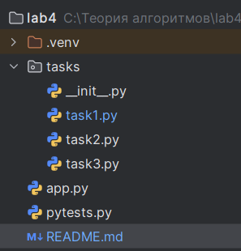

# Lab Generator - Генераторы и параллельная обработка данных

Десктопное приложение для работы с генераторами и параллельной обработкой данных с графическим интерфейсом, разработанное на Python с использованием PySide6.

## Описание

Lab Generator позволяет:
- Вычислять значения линейной функции в заданном диапазоне;
- Проверять комбинации чисел на возможность образования треугольника;
- Находить максимальные уникальные значения из списка чисел.

Программа предоставляет удобный графический интерфейс для ввода данных, отображения результатов и запуска параллельных вычислений.

## Структура проекта


## Основные возможности

### Задание 1
- Генератор линейной функции `f(x) = 0.5x - 2`
- Диапазон и шаг задаются пользователем
- Вывод первых n значений
- Параллельная версия для ускорения вычислений

### Задание 2
- Генератор комбинаций трёх целых чисел в диапазоне [2; 20]
- Проверка возможности образования треугольника
- Вывод первых n результатов
- Параллельная версия для ускорения обработки

### Задание 3
- Обработка строки чисел, разделённых пробелами
- Выбор n наибольших уникальных значений
- Параллельная обработка чисел с использованием потоков

### Интерфейс
- Вкладки для каждой задачи
- Поля ввода диапазонов, количества значений и строки чисел
- Кнопки запуска генераторов и параллельных версий
- Область вывода результатов для удобного просмотра

---

## Инструкции по запуску

1. Скачайте или склонируйте файлы проекта.
2. Откройте терминал в папке с проектом.
3. Запустите главный файл приложения:
```bash
python App.py
лаб4
